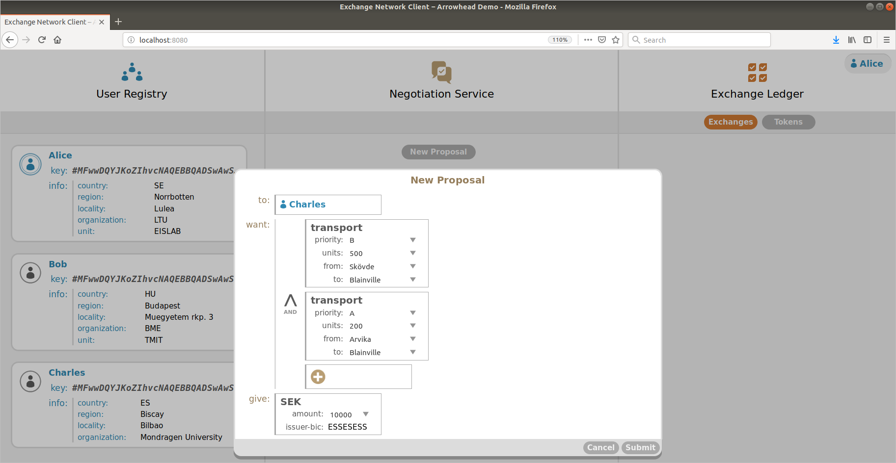

# Signature Chains Proof-of-Concept

This repository contains a proof-of-concept implementation of the _Exchange Network_ architecture,
based on a data structure referred to as the _Signature Chain_. An Exchange Network implementation
is used for negotiating about and exchanging virtual ownerships, referred to as _tokens_.

The implementation is described in the paper _The Exchange Network: A General-Purpose Architecture_
_for Digital Negotiation and Exchange_, which currently is pending acceptance and, therefore,
cannot be referenced at this point. A link to the paper will be added here as soon as it becomes
publicly available.

While running, the application could look as follows:



## Design

The application is divided into two major parts, referred to as the [`node`][node] and the
[`client`][client]. The [`node`][node] communicates with other nodes, as well as serving the
resources necessary for a browser to host a [`client`][client]. Consequently, the application
facilitates a peer-to-peer network, where each node can negotiate and exchange ownerships
with any other node, without it being visible to any other nodes.

## Important Delimitations

As this implementation was never intended for production use, some important delimitations were
made to reduce implementation effort. The delimitations are listed below.

- __No authentication or authorization__. Each [`node`][node] will grant access to anyone asking
  for its [`client`][client] and accept any action invoked via its JSON-RPC API.
- __No encrypted transports__. All communications are sent as clear-text.
- __Static User Registry__. User data cannot change during runtime. Rather, such must be provided
  at application start-up in the form of a `.json` file, which must adhere to the specification in
  [`source/node/Options.ts`](source/node/Options.ts).
- __Static Definition Bank__. Token type definitions, which in this application is referred to as
  _token templates_, cannot change during runtime. They must be provided at application start-up
  in the same `.json` file as the static user data already mentioned.
- __Definitions are ignored during verification__. One primary reason for using the Signature Chain
  data structure is being able to verify the predecessor and definitions of each record. Currently,
  however, definitions are not verified. The current state could be be assumed to imply that all
  token definitions are well-known to all participants.
- __Predecessors cannot be configured.__ Rather, any previous exchange between the same two parties
  is always chosen as the predecessor of any new exchange.

## Code Organization

The following table names and briefly describes some important files and folders of this
repository.

| File                           | Description                                                    |
|:-------------------------------|:---------------------------------------------------------------|
| [`demo/`][demo]                | Folder containing default demo data.                           |
| [`demo/README.md`][demomd]     | Description of default demo data.                              |
| [`demo/start.sh`][demosh]      | Starts default application demo.                               |
| [`source/`][source]            | TypeScript source code folder.                                 |
| [`source/client/`][client]     | Browser client, served by [`node`][node].                      |
| [`source/model/`][model]       | Data types used by both [`client`][client] and [`node`][node]. |
| [`source/model/xnet.ts`][xnet] | The data types mentioned in the Exchange Network paper.        |
| [`source/node/`][node]         | Node source code.                                              |
| [`source/node/server/`][server]| Server used by [`node`][node] to serve [`client`][client].     |
| [`source/node/Peer.ts`][peer]  | Class used to relay interactions with other [`nodes`][node].   |
| [`www/`][www]                  | Static resources served by [`node server`][server].            |
| [`Dockerfile`][dockerfile]     | Allows creation of container holding demo application.         |

## Building and Running

### POSIX Environment

Given that you have access to a POSIX environment, such as Linux, macOS, or Cygwin, as
well as having [`git`](https://www.git-scm.com) and [`npm`](https://www.npmjs.com) installed on
your computer, downloading and installing should be doable via the below terminal commands.

```sh
$ git clone https://github.com/emanuelpalm/en-signature-chains-poc.git
$ cd en-signature-chains-poc/
$ npm install
$ npm run build
$ cd demo/
$ ./start.sh
```

This will start three nodes, serving their clients via [`localhost:8080`](http://localhost:8080),
[`localhost:8082`](http://localhost:8082) and [`localhost:8084`](http://localhost:8084).

### Other Environments

If none of the above mentioned environments are available, of if you fail to get them to work
properly, an alternative is to use a [Docker](https://www.docker.com) container. We provide a
[`Dockerfile`][dockerfile] in the repository root folder.

Note that the Dockerfile will copy over the [`demo/`][demo] folder and the
[`start-demo.sh`][demosh] file into the created container, which means that if any other
configuration is desired than the one provided for the default demo, those files need to be
changed prior to building the container.

[client]: source/client
[demo]: demo
[demomd]: demo/README.md
[demosh]: demo/start.sh
[dockerfile]: Dockerfile
[model]: source/model
[node]: source/node
[peer]: source/node/Peer.ts
[server]: source/node/server
[source]: source
[www]: www
[xnet]: source/model/xnet.ts

## Contributing

Contributions other than minor fixes are unlikely to be considered at this time. If you would like
to make a larger change or add new features, please create an issue and ask about it first. You
are, of course, free to fork the repository and make changes on your own. The code is provided
under the [Apache 2.0](LICENSE) license.