# Default Demo

The demo in this folder consists of three parties able to complete 6 contractual
interactions. The parties are as follows:

| Party                         | Description                                  |
|:------------------------------|:---------------------------------------------|
| [Final _Assembly_ Plant][asm] | A factory needing components from _Supplier_.|
| [_Supplier_][sup]             | A factory producing and supplying components.|
| [_Carrier_][car]              | A trucking company transporting goods.       |

The _Final Assembly Plant_, _Supplier_ and _Carrier_ are assumed to already
have traditional contracts in place, giving meaning to the different tokens
exchanged during the 6 interactions.

The interactions are summarized as follows:

| # | Interaction               | Initiator | Receiver | Description           |
|:--|:--------------------------|:----------|:---------|:----------------------|
| 1 | Component Order           | Assembly  | Supplier | Assembly orders components.|
| 2 | Transport Booking         | Supplier  | Carrier  | Supplier books transportation.|
| 3 | Transport Confirmation    | Carrier   | Assembly | Carrier confirms transport with recipient.|
| 4 | Transport Completion      | Carrier   | Assembly | Carrier asks recipient to confirm transport completion.|
| 5 | Transport Payment Request | Carrier   | Supplier | Carrier asks client to pay for the transportation.|
| 6 | Component Payment Request | Supplier  | Assembly | Supplier asks assembly to pay for components.|

Note that these steps are not executed automatically. In order to run through
them, start the demo as described in the root [README.md][rmd] file, and then
follow the instructions further below. Each step represent one change in the
rights and obligations between the initiator and receiver.

The below diagram gives an overview of the same steps described in the above table.

| 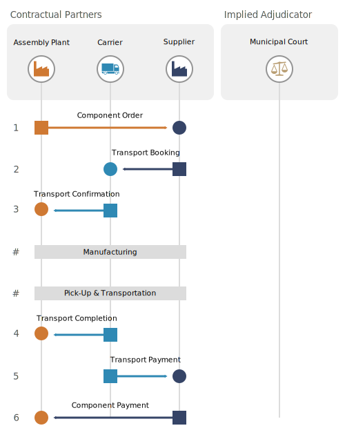 |
|:-:|
| Diagram showing the partners part of the demonstration. A fourth implied partner is a municipal court decided upon by all parties when the assumed frame agreement was signed by the partners. The municipal court is assumed to be able to consider any completed exchanges as evidence in the case of any disputes. |

[asm]: http://localhost:8080
[sup]: http://localhost:8084
[car]: http://localhost:8082
[rmd]: ../README.md

## Step by Step Interaction Instructions

### Step 1: Component Order

In this step, the _Final Assembly Plant_ places an order for certain components
from the _Supplier_. The order includes an expected delivery date, a number of
units, and a component type.

To create a proposal, click the "New Proposal" button in the _Negotiation_
_Service_ column of the client of the _Final Assembly Plant_, which is
identified in the upper right corner of the graphical user interface, or by the
address `localhost:8080`, if the demo application is running locally. At this
point, a dialog has appeared as in the image below.

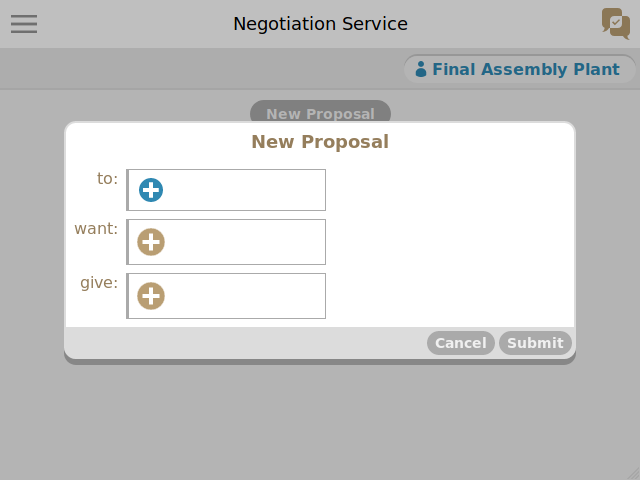

By clicking the button next to the "to:" label, one may select a receiver, as
shown below. Select _Supplier_ in the list.

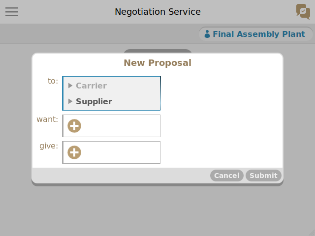

In order to state that a component order is desired, click the button next to
the "want:" label. This brings up a menu in which one may select "AND", "OR",
"NOT" or "NEW", as shown below. 

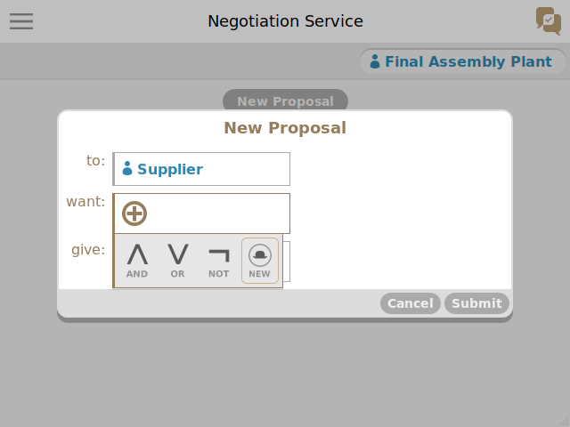

The three first ones are for creating logical expressions,
which you may experiment with at some other time if you like. We will, however,
choose the "NEW" alternative, which brings up the below list of tokens that can
be created by the _Final Assembly Plant_. Select "XCO: Component Order".

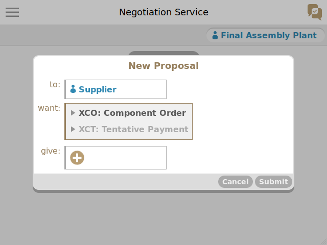

The token in our proposal is _unqualified at this point_, as it lacks a unique
identifier. Such unqualified tokens, as shown below, are useful for expressing
what is desired without making any commitments.

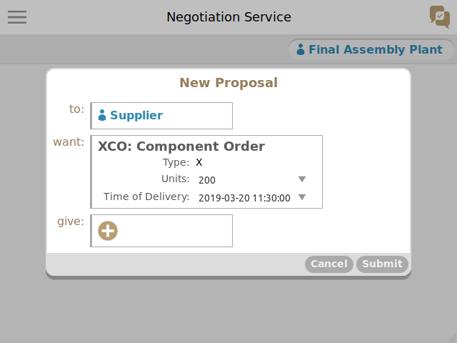

As we are commited to this order, we will click the "XCO: Component Order"
label in order to bring up the menu shown below.

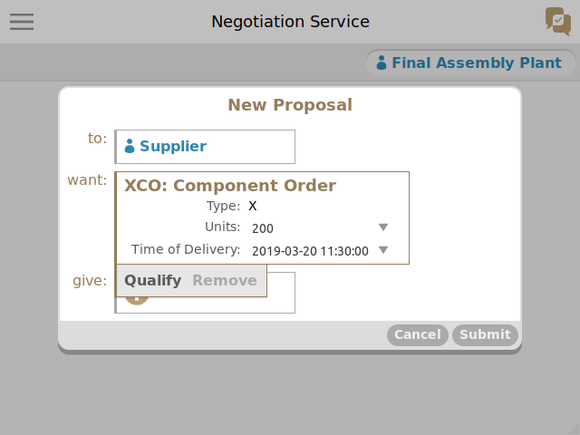

Click "Qualify" to assign the token a unique identifier, as below.

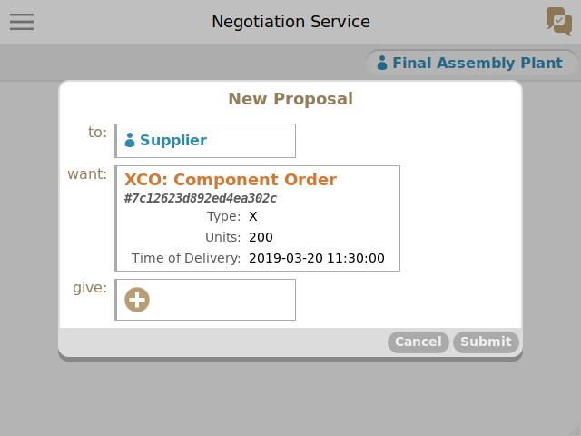

As we now now how to create qualified tokens, we proceed to create another one
next to te "give:" label containing a tentative payment, as shown below.

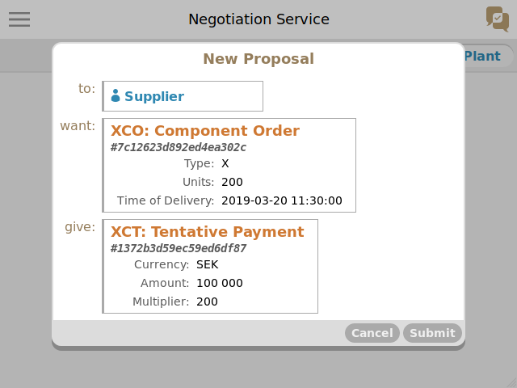

A tentative payment is a promise to pay in the case certain contractual
obligations are later fulfilled. In this example scenario, we assume that all
parties know the implications of accepting ownership of or giving up ownership
of all tokens we handle.

After sending the proposal by clicking "Submit", we
move on to the client of the _Supplier_, which is available at `localhost:8084`
if you are running the demo locally. Looking at the _Negotiation Service_
column, you should find the below proposal.

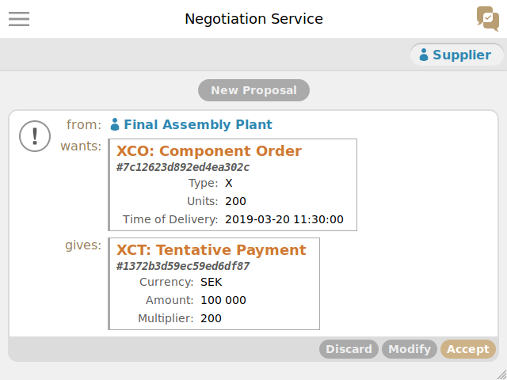

You can either discard, modify or accept it as is. If you modify it, your
modified  proposal will be sent back and the negotiation continue. If you
accept the  proposal, it will be finalized and added to the _Exchange Ledgers_
of both  the _Final Assembly Plant_ and _Supplier_. The _Carrier_ will not be
aware of the exchange, and neither will any other party.

Click "accept" to accept and finalize the proposal, which should make the
proposal appear as below.

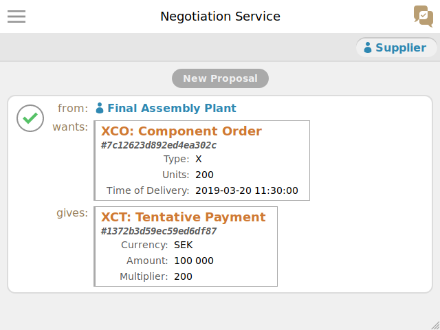

Please look in the _Exchange Ledger_ columns of the _Final Assembly Plant_ and
the  _Supplier_ to view the finalized exchange. We will now proceed to step 2.

We will cover subsequent steps in much less detail.

### Step 2: Transport Booking

As the _Supplier_ has committed to manufacturing and delivering 200 X components
to the _Final Assembly Plant_ at a certain date and time, transportation must
be arranged. For this reason we create the below proposal and send it to the
_Carrier_.

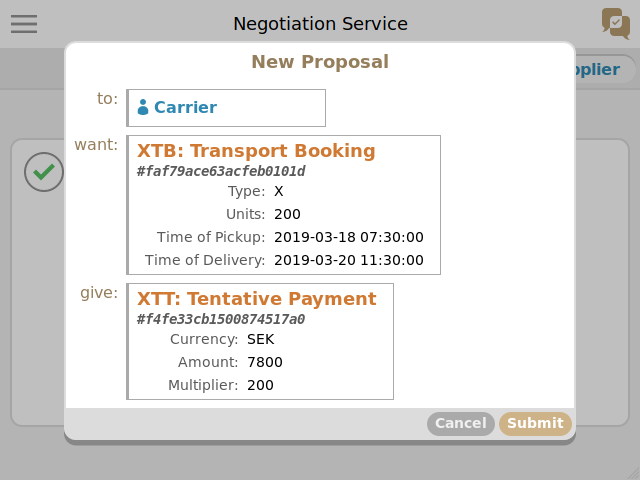

We assume that the _Carrier_ already knows it is supposed to transport the units
to the _Final Assembly Plant_. Submit the proposal, and then bring up the
_Carrier_'s client, which is available at `localhost:8082` if you are running
the demo locally. Accept the proposal.

### Step 3: Transport Confirmation

At this point, the _Final Assembly Plant_ must confirm it is ready to receive
a component delivery at the time agreed between the other two parties, for
which reason the _Carrier_ sends the below proposal to the _Final Assembly_
_Plant_.

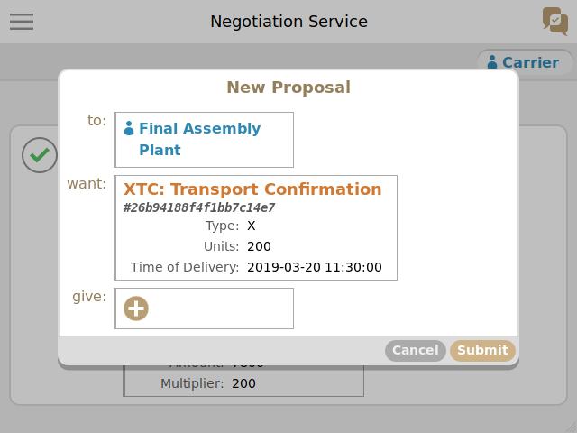

Nothing is given at this point, as all that is wanted is a confirmation that
the delivery is expected and the date and time is acceptable.

### Step 4: Transport Completion

We assume that the components are manufactured and that the _Carrier_ comes and
picks them up from the _Supplier_, after which the _Carrier_ arrives with them
at the _Final Assembly Plant_. When unloaded, the _Carrier_ then requests that
the _Final Assembly Plant_ confirm that the delivery has been completed, as
shown below.

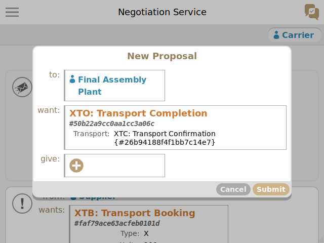

### Step 5: Transport Payment Request

As the transport has been completed successfully, the _Carrier_ now needs to
make the _Supplier_ pay for the transport, as was agreed initially. This is
done as in the image below.

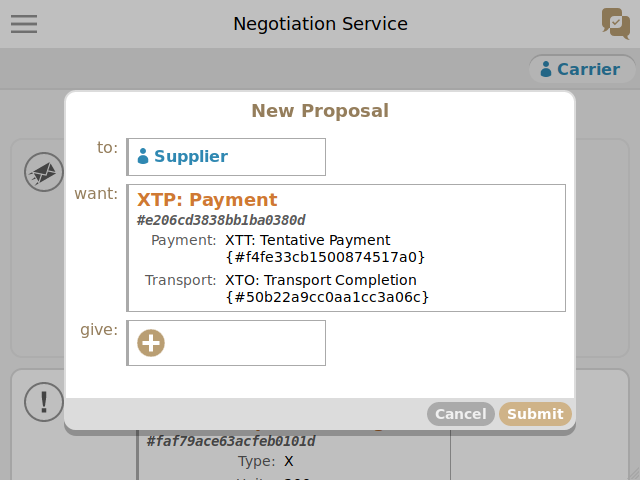

Note how the token in the proposal refers to a tentative payment token and a
transport completion token. The tentative payment token is known to both the
_Carrier_ and the _Supplier_, as it was created by the first exchange between
the two parties. The transport completion token, however, is only known to the
_Final Assembly Plant_ and the _Carrier_. The _Carrier_'s node will notice this
automatically, however, and send over the exchange holding the referred token
to the _Supplier_. This way the _Supplier_ is provided with evidence that the
_Final Assembly Plant_ has received the components, and that it is obliged to
pay for the transport.

After submitting the proposal, the below can be seen in the _Exchange Ledger_
column of the _Supplier_. Note how the _Supplier_ is neither the proposer or
acceptor of the exchange.

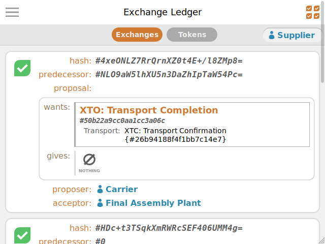

### Step 6: Component Payment Request

After the _Carrier_ being payed, the only remaining step is for the _Supplier_
to be payed by the _Final Assembly Plant_. As the _Supplier_ was given evidence
about the _Final Assembly Plant_ completing the transport in step 5, it now
has the evidence required to know that the _Final Assembly Plant_ is obliged
to pay for the components. Consequently, we create the below proposal from the
_Supplier_ to the _Final Assembly Plant_.

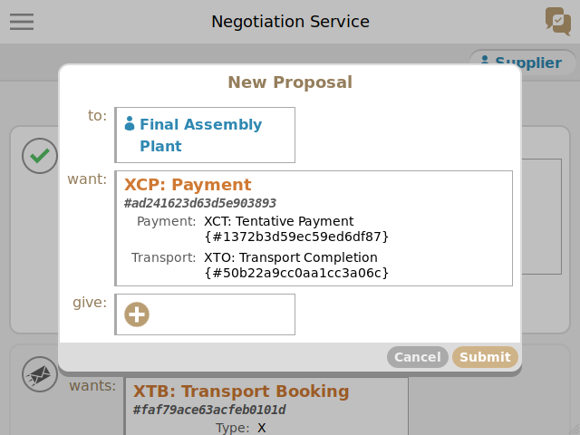

The token in this proposal references both the initial tentative payment
between the two parties, which describes how much is to be payed and for what,
and the transport completion from the _Carrier_.

### Final Reflections

At this point, you may have objections regarding the simplicity of the scenario,
or  perhaps about the fact that the _Supplier_ accepted to deliver components at
a certain date and time without knowing if the _Carrier_ would be able to
deliver at that point. The point of this demonstration is not to show what a
real-world use case would look like, however, but to communicate important ideas
about how this technology functions. Note that all the interactions you just
went through could be executed automatically by a computer. The graphical user
interface is just a convenience for allowing humans to follow along.